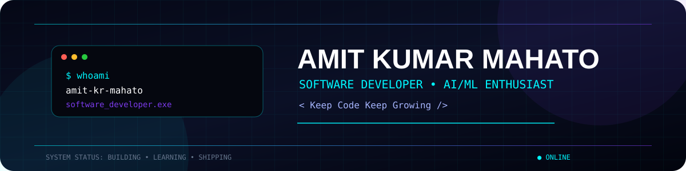
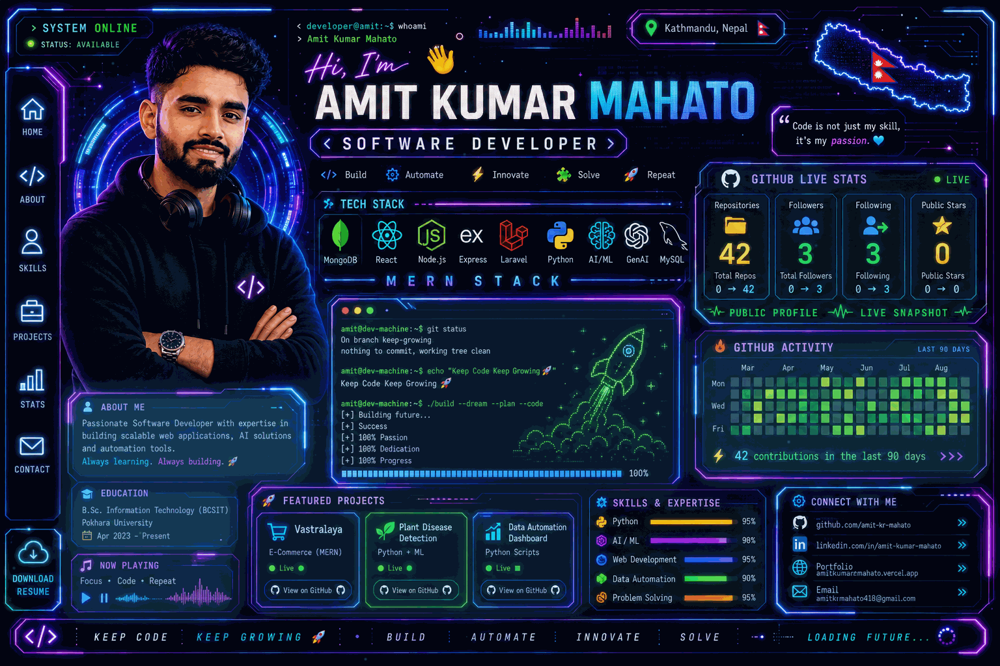
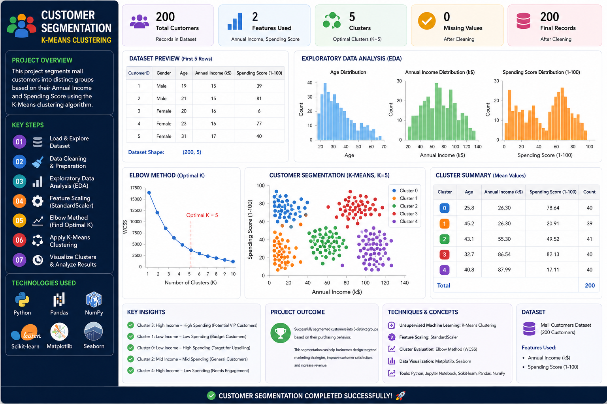
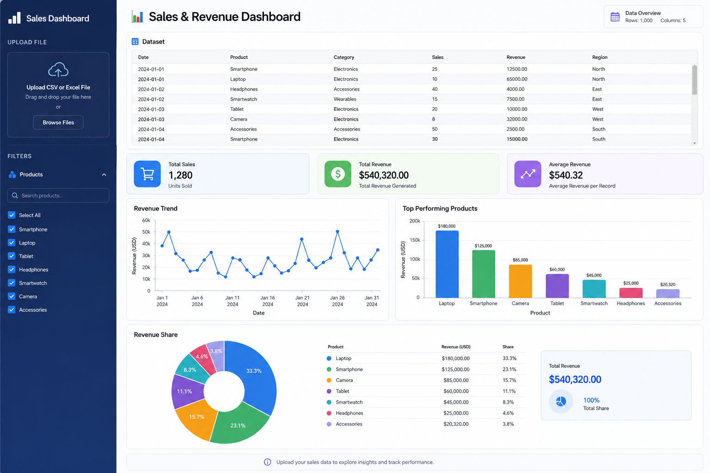
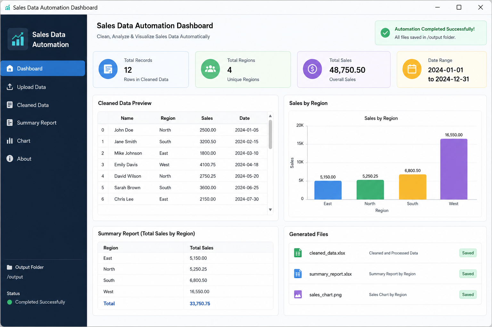
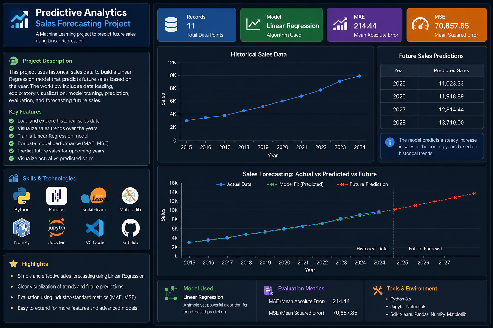
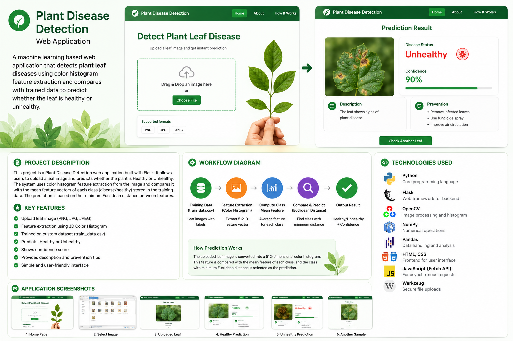
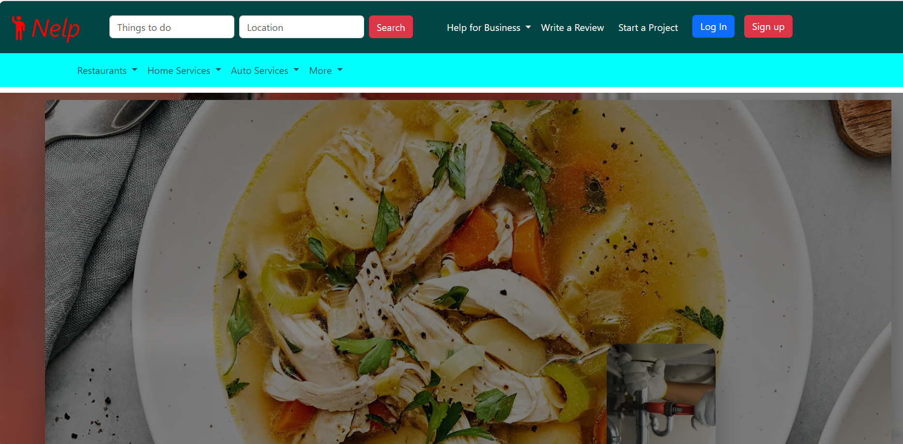

<div align="center">

<!-- ═══════════════════════════════════════════════════════════════ -->

<!--                        HERO BANNER                             -->

<!-- ═══════════════════════════════════════════════════════════════ -->

<picture>
  <source
    media="(prefers-color-scheme: dark)"
    srcset="./assets/banner.svg"
  />
  <source
    media="(prefers-color-scheme: light)"
    srcset="./assets/banner.svg"
  />
  
</picture>

<br/>

<!-- ═══════════════════════════════════════════════════════════════ -->

<!--                      TYPING ANIMATION                          -->

<!-- ═══════════════════════════════════════════════════════════════ -->

<a href="https://github.com/amit-kr-mahato">


</a>

<br/><br/>

<!-- ═══════════════════════════════════════════════════════════════ -->

<!--                       PROFILE STATS                             -->

<!-- ═══════════════════════════════════════════════════════════════ -->

<a href="https://github.com/amit-kr-mahato">


</a>

<a href="https://github.com/amit-kr-mahato?tab=followers">


</a>

<a href="https://github.com/amit-kr-mahato?tab=repositories">


</a>

<br/><br/>

<!-- ═══════════════════════════════════════════════════════════════ -->

<!--                         SOCIAL LINKS                            -->

<!-- ═══════════════════════════════════════════════════════════════ -->

<a href="https://github.com/amit-kr-mahato">
  
</a>

<a href="https://www.linkedin.com/in/amit-kumar-mahato-7a15752b4/">
  
</a>

<a href="mailto:singhamit984537@gmail.com">
  
</a>

<br/><br/>

<!-- ═══════════════════════════════════════════════════════════════ -->

<!--                         STATUS                                 -->

<!-- ═══════════════════════════════════════════════════════════════ -->


</div>

---

# 👨‍💻 About Me

<div align="center">

<!-- Animated developer / ID-card GIF -->



</div>

<br/>

<div align="center">

<a href="https://github.com/amit-kr-mahato">
  
</a>

<a href="https://github.com/amit-kr-mahato">
  
</a>

<a href="https://github.com/amit-kr-mahato">
  
</a>

</div>

<br/>

I'm **Amit Kumar Mahato**, a **Software Developer and BCSIT student** passionate about building practical, scalable and modern software solutions.

I work across the full stack, building applications with **React, Node.js, Express.js, MongoDB, Laravel, PHP and Python**.

I'm also exploring **Machine Learning, Generative AI and Retrieval-Augmented Generation (RAG)** to create intelligent, data-driven applications.

My development philosophy is simple:

<div align="center">

### 💻 Build → 🧠 Learn → ⚡ Improve → 🚀 Ship

</div>

---

## 🧬 Developer Profile

```yaml
developer:
  name: "Amit Kumar Mahato"
  username: "amit-kr-mahato"
  role: "Software Developer"
  education: "BCSIT"
  location: "Nepal"

specialization:
  - Full Stack Web Development
  - MERN Stack
  - Laravel & PHP
  - REST API Development
  - Database Management
  - Python
  - Machine Learning
  - Generative AI
  - Retrieval-Augmented Generation

primary_stack:
  frontend:
    - React.js
    - JavaScript
    - HTML
    - CSS
    - Bootstrap
    - Tailwind CSS

  backend:
    - Node.js
    - Express.js
    - Laravel
    - PHP

  database:
    - MongoDB
    - MySQL
    - SQL

  ai_ml:
    - Python
    - Machine Learning
    - Data Analytics
    - Generative AI
    - RAG

tools:
  - Git
  - GitHub
  - VS Code
  - Postman
  - Docker

currently_learning:
  - Advanced Machine Learning
  - Generative AI
  - RAG Applications
  - AI Engineering
  - System Design
  - Cloud Technologies
  - Scalable Backend Architecture

philosophy: "Keep Code Keep Growing 🚀"
```

---

# ⚡ What I Do

<div align="center">

<table>
<tr>

<td width="25%" align="center">

### 🌐

### Full Stack

React + Node + Express + MongoDB

</td>

<td width="25%" align="center">

### 🤖

### AI / ML

Python + ML + AI

</td>

<td width="25%" align="center">

### 🧠

### Generative AI

LLMs + RAG

</td>

<td width="25%" align="center">

### 📊

### Data

Analytics + Automation

</td>

</tr>
</table>

</div>

---

# 🛠️ Technology Arsenal

<div align="center">

### 💻 Programming


<br/><br/>

### ⚛️ Frontend


<br/><br/>

### ⚙️ Backend


<br/><br/>

### 🗄️ Databases


<br/><br/>

### 🤖 AI / Machine Learning


<br/><br/>


<br/><br/>

### 🧰 Tools


</div>

---
# 🚀 Featured Projects

<div align="center">

<table>
<tr>

<!-- ================= CUSTOMER SEGMENTATION ================= -->

<td width="50%" valign="top">

<a href="https://github.com/amit-kr-mahato/Customer-Segmentation">



</a>

<h3>🧠 Customer Segmentation</h3>

<p>
Data-driven machine learning project focused on customer behavior analysis and segmentation.
</p>

<p>
<b>Python</b> · <b>Machine Learning</b> · <b>Data Analytics</b>
</p>

<a href="https://github.com/amit-kr-mahato/Customer-Segmentation">

</a>

</td>

<!-- ================= SALES DASHBOARD ================= -->

<td width="50%" valign="top">

<a href="https://github.com/amit-kr-mahato/SalesRevenueDashboard">



</a>

<h3>📊 Sales Revenue Dashboard</h3>

<p>
Interactive dashboard focused on analyzing sales performance, revenue and business trends.
</p>

<p>
<b>Data Analytics</b> · <b>Visualization</b> · <b>Dashboard</b>
</p>

<a href="https://github.com/amit-kr-mahato/SalesRevenueDashboard">

</a>

</td>

</tr>

<tr>

<!-- ================= DATA AUTOMATION ================= -->

<td width="50%" valign="top">

<a href="https://github.com/amit-kr-mahato/data-automation-project">



</a>

<h3>⚙️ Data Automation</h3>

<p>
Automation project focused on data processing, transformation and repetitive workflow automation.
</p>

<p>
<b>Python</b> · <b>Data Processing</b> · <b>Automation</b>
</p>

<a href="https://github.com/amit-kr-mahato/data-automation-project">

</a>

</td>

<!-- ================= PREDICTIVE ANALYTICS ================= -->

<td width="50%" valign="top">

<a href="https://github.com/amit-kr-mahato/predictive-Analytics">



</a>

<h3>🔮 Predictive Analytics</h3>

<p>
Machine learning project focused on identifying patterns and generating predictive insights from data.
</p>

<p>
<b>Python</b> · <b>Machine Learning</b> · <b>Analytics</b>
</p>

<a href="https://github.com/amit-kr-mahato/predictive-Analytics">

</a>

</td>

</tr>

<tr>

<!-- ================= PLANT DISEASE ================= -->

<td width="50%" valign="top">

<a href="https://github.com/amit-kr-mahato/plant_disease_projects">



</a>

<h3>🌱 Plant Disease Detection</h3>

<p>
Machine learning project focused on image-based plant disease identification and classification.
</p>

<p>
<b>Python</b> · <b>Machine Learning</b> · <b>Computer Vision</b>
</p>

<a href="https://github.com/amit-kr-mahato/plant_disease_projects">

</a>

</td>

<!-- ================= BIZZLISTO ================= -->

<td width="50%" valign="top">

<a href="https://github.com/amit-kr-mahato/Bizzlisto">



</a>

<h3>🏙️ Bizzlisto</h3>

<p>
Full-stack business discovery and listing platform designed for discovering and managing businesses.
</p>

<p>
<b>MERN</b> · <b>REST APIs</b> · <b>Authentication</b> · <b>MongoDB</b>
</p>

<a href="https://github.com/amit-kr-mahato/Bizzlisto">

</a>

</td>

</tr>
</table>

<br/>

<!-- ================= ALL REPOSITORIES ================= -->

<a href="https://github.com/amit-kr-mahato?tab=repositories">


</a>

</div>

---

# 💼 Professional Experience

## 🚀 Full Stack Developer Intern — CODE IT

**April 2026 – July 2026 · Kathmandu, Nepal · Remote**

```text
Frontend        → React.js
Backend         → Node.js + Express.js
Database        → MongoDB
Authentication  → JWT
API             → RESTful APIs
Version Control → Git + GitHub
```

### Key Contributions

* Developed responsive full-stack web applications.
* Built and integrated RESTful APIs.
* Implemented authentication and authorization.
* Worked with MongoDB and CRUD operations.
* Debugged and optimized application functionality.
* Used Git and GitHub for development workflows.
* Participated in testing and code-review processes.

---

# 🤖 AI / ML Journey

<div align="center">


</div>

```text
Python
   │
   ▼
Data Processing
   │
   ▼
Machine Learning
   │
   ├──────────────► Predictive Analytics
   │
   ▼
Generative AI
   │
   ▼
Retrieval-Augmented Generation
   │
   ▼
AI-Powered Applications
```

### 🔬 Current AI Focus

* 🐍 Python
* 📊 Data Analytics
* 🤖 Machine Learning
* 🧠 Generative AI
* 📚 RAG Applications
* 💬 AI Chatbots
* 🔎 Intelligent Search
* ⚙️ AI Automation

---

# 📊 GitHub Analytics

<div align="center">

<a href="https://github.com/amit-kr-mahato">


</a>

<a href="https://github.com/amit-kr-mahato">


</a>

<br/><br/>


<br/><br/>


</div>

---

<!-- # 🔥 Contribution Streak -->

<div align="center">


</div>

---


## 🐍 Contribution Snake

<div align="center">


</div>


---

# 🏆 GitHub Achievements

<div align="center">


</div>

---

# 📈 Contribution Activity

<div align="center">


</div>

---

# 🎯 2026 Roadmap

<div align="center">


</div>

---

# 📜 Certifications & Learning

<div align="center">


</div>

---

# 💡 Developer Philosophy

<div align="center">


</div>

---

# 🌐 Connect With Me

<div align="center">

<a href="https://github.com/amit-kr-mahato">

</a>

<a href="https://www.linkedin.com/in/amit-kumar-mahato-7a15752b4/">

</a>

<a href="mailto:singhamit984537@gmail.com">

</a>

</div>

<br/>

<div align="center">


<br/><br/>


</div>
